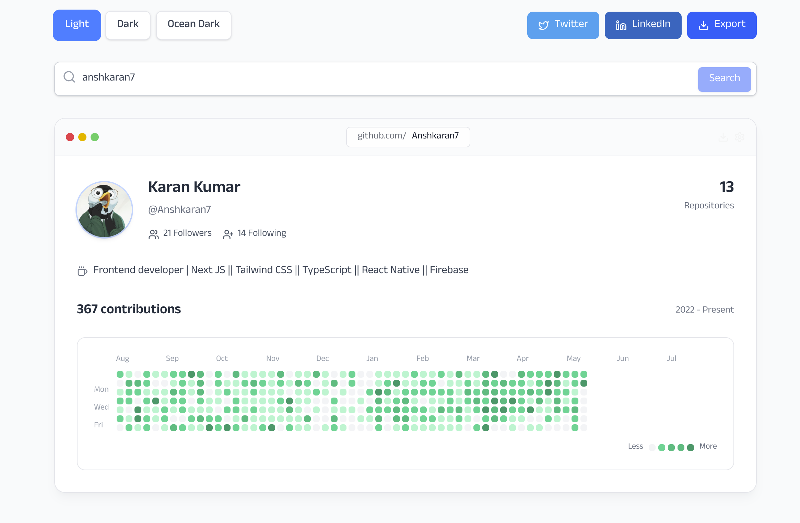

_Preview of the git-aura user profile interface_

# git-aura

A modern, open-source web application built with [Next.js](https://nextjs.org/) and TypeScript. Designed for rapid development, scalability, and best-in-class developer experience.

## Features

- ⚡️ Next.js 14+ with App Router
- 🛠 TypeScript for type safety
- 🎨 Optimized font loading with `next/font` (Geist)
- 💅 CSS/PostCSS for styling
- 🔥 Hot reloading and fast refresh
- 📦 Zero-config setup
- 🚀 Ready for deployment on [Vercel](https://vercel.com/)

## Getting Started

Clone the repository:

```bash
git clone https://github.com/Anshkaran7/git-aura.git
cd git-aura
```

Install dependencies:

```bash
npm install
# or
yarn install
# or
pnpm install
```

Run the development server:

```bash
npm run dev
# or
yarn dev
# or
pnpm dev
```

Open [http://localhost:3000](http://localhost:3000) to view the app.

## Project Structure

- `src/app/` – Main application code (pages, layouts, components)
- `public/` – Static assets
- `next.config.ts` – Next.js configuration
- `tsconfig.json` – TypeScript configuration

## Contributing

Contributions are welcome! Please open issues or pull requests for improvements or bug fixes.

## License

This project is open source and available under the [MIT License](LICENSE).

## Resources

- [Next.js Documentation](https://nextjs.org/docs)
- [Vercel Deployment Guide](https://nextjs.org/docs/app/building-your-application/deploying)
- [Geist Font](https://vercel.com/font)

---

> Inspired by the [git-aura](https://github.com/Anshkaran7/git-aura) project.
